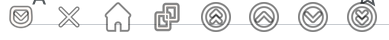

## How to show close tab button on each active tab?

Install **Show Close Tab Button** browser extension.

  <button class="button" onclick="window.location.href = 'https://addons.mozilla.org/en-US/firefox/addon/show-close-tab-button/'">
   Show Close Tab Button for Firefox    </button>
  <button class="button" onclick="window.location.href = 'https://paypal.me/zhihaushiu'">
   Paypal Me
  </button>
  <!--
    <button class="button">
       Action 3
    </button>
    <button class="button">
       Action 4
    </button>
  -->

The **show-close-tab-button** extension shows a close button or some useful buttons on each active tab. And you can add buttons and set the arrangement and position of buttons yourself.

   

- **Close Tab Button**: You can close the current tab with a simple click of a button.
- **Pocket Button**: You can save web pages to your pocket with the click of a button without going through layers of menus.
- **Home Button**: If there is no Home button on the page, you can simply click this button to return to the home page.
- **Duplicate Tab Button**: Clicking this button will copy the current tab.
- **Scroll to Top Button**: Press this button to go to the top of the page.
- **Page Up Button**: Press this button to scroll up a page.
- **Page Down Button**: Press this button to scroll down a page.
- **Scroll to Bottom Button**: Press this button to go to the bottom of the page.

**Scroll to Top/Bottom Button and Page Up/Down Button** support entire web page and AI chatbot ([chatgpt](https://chatgpt.com), [perplexity.ai](https://www.perplexity.ai/), [copilot](https://copilot.microsoft.com), [claud.ai](https://claude.ai/) for desktop) chat page.

**Show Close Tab Button** doesn't show ads and doesn't send user's data.
    
<!-- 圖片容器 -->

   

## More extensions by zhihaushiu
  -  [Show Pocket Button](https://addons.mozilla.org/en-US/firefox/addon/show-pocket-button/)
  -  [Duplicate Tab](https://addons.mozilla.org/en-US/firefox/addon/duplicate-tab-for-fx-mobile/)
  -  [Show Alias](https://addons.mozilla.org/en-US/firefox/addon/show-alias/)
     
  

